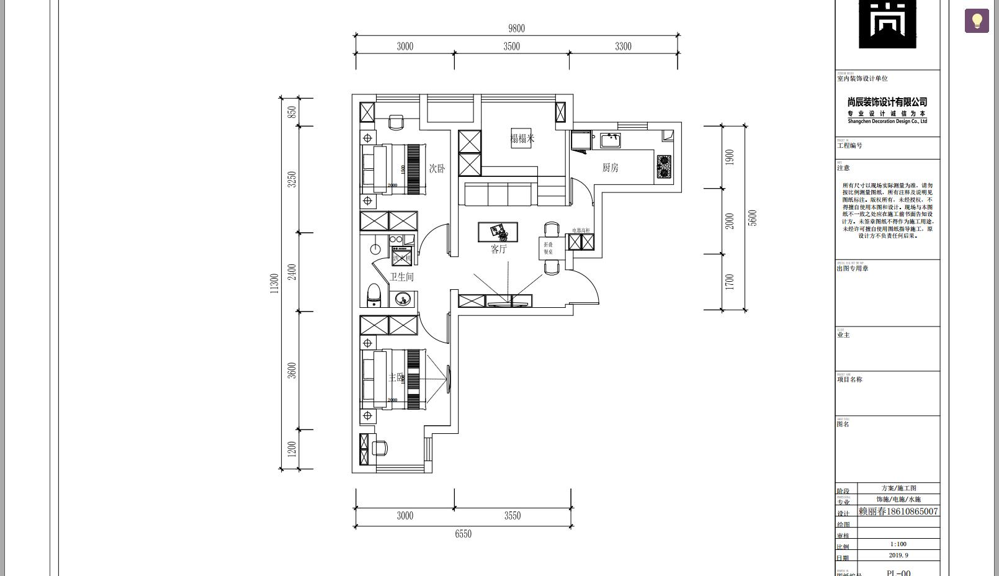

## 别人家的设计图

### 平面图

*所有图片如有侵权，告知立删*

1. 

``` wiki
原始图
```


2. 

``` wiki
能接受 墙全砸
不能接受 沙发和电视的摆放位置
```


3. 

```wiki
详细的原图
```


4.

``` wiki
开发商的设计
```


5.

``` wiki
实测数据图
```


6.

``` wiki
不能接受看电视有人进出卫生间感觉影响看电视的感觉
```


7.

``` wiki
墙比较理想，不知道改动大不
电位自己调整适合自己为主
```


8.

``` wiki

```


9.

``` wiki

```

<<<<<<< HEAD

10.

``` wiki

```


11.

``` wiki

```


12.

``` wiki

```


13.

``` wiki

```


=======

>>>>>>> be2c7c0cc59240441070b76f3aacfb9128252325
