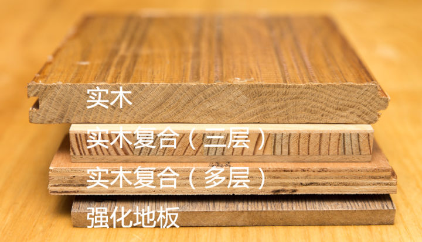
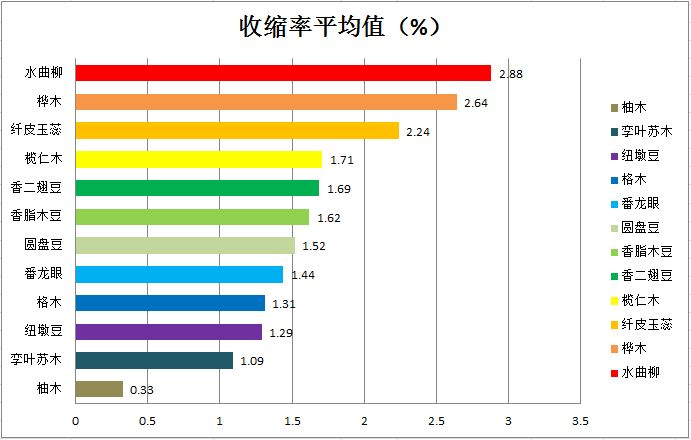
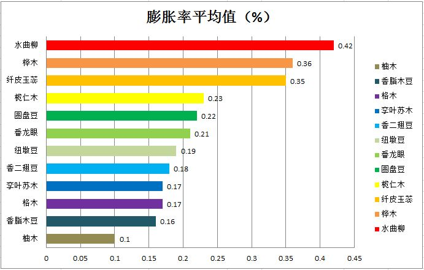

# 木地板

``` wi
1. 看钱说话
2. 安装地板必需本人在场一定要在场亲自在
3. 大店小店都去问问价。
4. 地板测平工作不能忘

```

**商家吹嘘的地方写到合同里（比如甲醛释放量E1/E2、树种、产地等），如果商家不敢写，就当他扯淡**

## 常见的种类

 

- 实木

  ``` wi
  1. 不容易坑，就是贵
  2. 尽量选择番龙眼 常见木材
  
  ```

  1. 本身材质环保，脚感舒服，反潮天时不会像地砖一样表面凝结水

     

     

     

  2. **柚木的收缩率和膨胀率都最低，水曲柳的收缩率和膨胀率最高**

  3. * 木材成本以及后期的保养维护成本
     * 实木地板比实木复合地板更容易变形（不推荐大尺寸的地板，大的贵变形影响大也易变）

- 实木复合

  ``` wi
  1. 可以选 三层实木复合（相对多层胶少点，弹性就弱点）
  2. 尽量选表层较厚的
  ```

  

- 强化复合

  ``` wi
  1. 不考虑，胶多，钱不够，上磁砖
  ```

  

## 常见的品牌

- 实木
  1. 代表品牌国产大自然，进口BOEN(大自然售后网评不好)
  2. 小作坊（看价格和木材）
- 实木复合
  1. 代表品牌国产书香门第，进口必美
- 多层实木复合
  1. 代表品牌国产书香门第，进口必美；
- 强化复合
  1. 代表品牌国产圣象，进口瑞士卢森


## 常识点

- 新手要记
  1. 买地板要问是否包安装
  2. 地板是一块块扣住，不用胶的
  3. 踢脚线也有两种安装方式，钉钉子(牢固不美观)或者挂住(美观但如果一变形就挂不住)
  4. 地板安装很简单的，地上找平了以后，铺个防潮垫（铝箔），就一块块地扣起来(不用龙骨)
  5. ~~地暖的家庭要选地暖专用的地板~~
  6. 地面找平的时候最好在现场看着，跟师傅多交流，尽量要求做薄点，据说一般找平2cm左右差不多
  7. 注意地板贴前不要用湿的墩布墩地哈，会返潮的
  8. 按照3331的铺法来，个人感觉二分之一的铺法太费了，顺光铺
  9. 地板按平米计算，一般赠送扣条
  10. 每块都要检查，不行就及时换 包括缝隙 掉角 掉皮
  11. 尽量不要在雨天安装
  12. 防虫

- 木材

```wi
高档：有柚木、美国红橡、美国山核桃等；

中档：有圆盘豆、栎木（橡木）、菠萝格等；

较为普遍：有番龙眼等之类的木种。
```

- 等级

- 鉴别

  1. 将两块地板放在一个很平很平的平面上，然后压住两块地板的同时进行拼接（横向），感受阻力/摩擦，越小越好，理论上应该基本没有摩擦
  2. 地板拼接后，进行抽拉（纵向），感受阻力/摩擦，越均匀越好

- 规格

  ```wi
  1. 一般910＊122＊18mm也叫标准板，如果厚度减少1mm，价格可以减少几十元
  ```

- 辅料

  1. **需要打龙骨么**

     推荐打，到时候看钱说话

     龙骨铺完了之后，还要再找平一次，不够平的地方，用垫片来调节

  2. 防潮垫

  3. 

- 安装

  ``` wiki
  1. 安装很重要 安装很重要 安装很重要.
  2. 木材会有伸缩，所以必须预留一定的空间（缝），供木材膨胀用，这个缝就叫伸缩缝（一般在踢脚线的厚度的一半以上）
  ```

  

