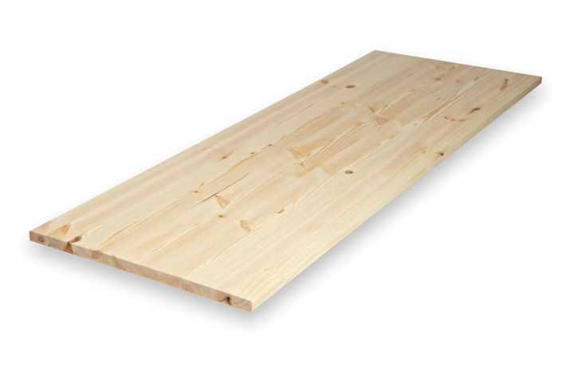
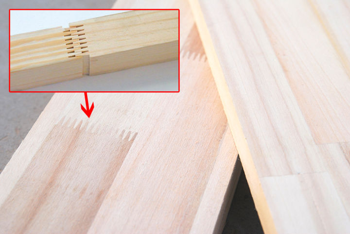
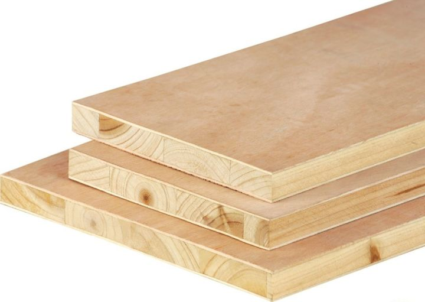
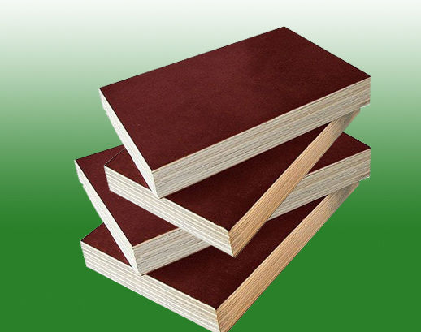
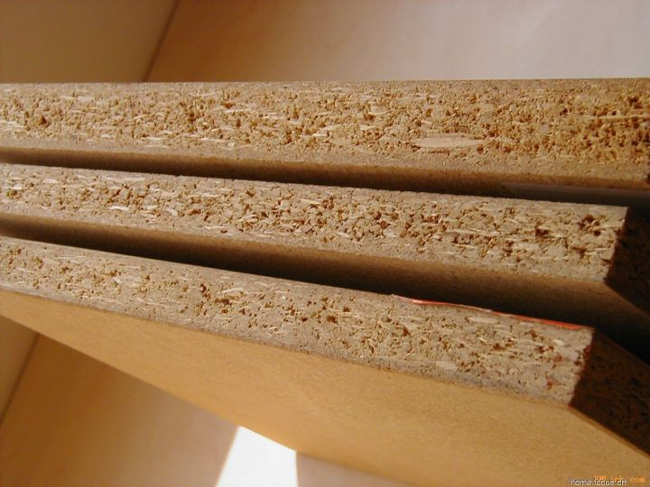
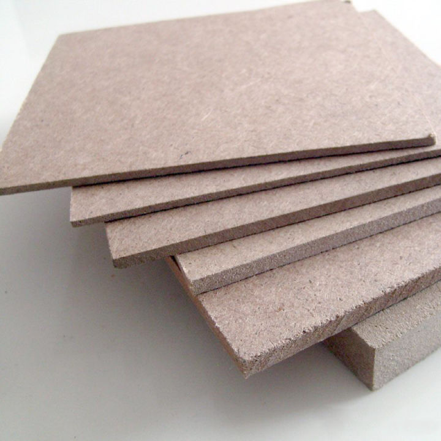

## 板材

*含胶越少越环保，这是一个大方向*

###  1.实木板

```
是家装中环保型最好的木板材。顾名思义，就是用完整木材制成的，其中不含任何化学成分，纯天然物质，但是价格高昂，施工工艺要求高，家装中除了地板和门之外，一般都不会用到实木板
```



### 2.指接板

``` wiki
又名集成材，是指将窄、短的木条采用胶粘剂竖向接长（常用齿型连接），然后再横向拼宽、上下两面砂光而成的板材；由于竖向采用锯齿状接口，类似两手手指交叉对接，故又称指接板。
```



### 3.细木工板

``` wiki
俗称大芯板、木芯板、木工板、马六甲板，是由两片单板（上下各一层或两层）中间胶压拼接木板而成。按层数可分为三层、五层、多层细木工板。五层细木工板最外层的单板叫表板，内层单板称中板，中间拼接板称芯板。
```



### 4.胶合板

``` wiki
又称夹板，多层板。是将木材旋切成单板或薄板，使相邻层单板的纤维方向互相垂直胶合而成的三层或多层的板式材料，胶合板能提高木材利用率，是节约木材的一个主要途径。
```



### 5.刨花板

``` wiki
利用木屑及木材边角料，加粘合剂后压制而成。看刨花板的板材横截面是由三层组成的，外面两成是细的颗粒，中间一层的是比较大的颗粒。
```



### 6.密度板

``` wiki
又名纤维板，是以木质纤维或其他植物纤维为原料，破碎厚施加胶粘剂压制而成。看密度板横截面，都是一样颜色和材质的细细的木质颗粒压在一起的。
```

