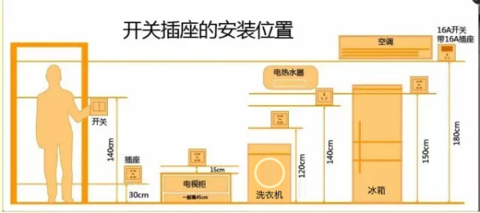

水电规定

```wiki
水走天（上面）电走地
最终一定要进行打压实现 30分钟以上
防水工程检验方法为关水24小时无渗漏即为合格
在改造水路的过程中，如涉及到下水问题，需在改造后第一时间进行下水管流水实验。确保下水排水畅通
```


## 水

1. 外接下水管的管子最好和原下水管匹配
2. 左热右冷，间距一般不小于20cm 左热右冷，两个出水口保持同一水平，冷热水之间的间距为15cm
3. 热水管间距应该超过13cm
4. 冷热水管的出水管口要突出墙面2至3cm，看墙体倾斜程度和瓷砖厚度，保证最后出水管口突出完成面
5. PPR管  水管管道的抗压能力最低不低于5公斤，建议大家选择“抗菌型”的水管 即管径为25mm，壁厚4.2mm；而热水管选择四分管，即管径为20mm，壁厚为2.3mm。排水管管径规格，一般洗脸盆水槽32-50mm，浴盆50mm，座便器100mm，妇洗器40-50mm 现在市面常用的水管品牌有上海天力、联塑、日丰、伟，星，这几种用的比较多，品牌可信赖
6. 所有的管线安装完毕，应该对铺设的现场进行清理，把多余的材料以及垃圾清理掉。还需要在管路的周围涂上一层防腐涂料，如果是明装的管路，则需要涂刷银粉。另外，在进行封槽时须与施工人员沟通好，避免装修用水泥掉落堵塞出入水管口
7. 都要做存水弯，防臭效果好。防臭地漏再好，也比不上存水弯的水封效果好。
8. 一般水电工还会布置一个隐形地漏，这个地漏在贴完瓷砖以后是看不见的，它隐藏在回填层里面。下水管改造时，记得检查一下。没有的话，最好让工人加上。这样的话，即使沉箱有了积水，也可以排水
9. 布置热水管时，加一层保温套，冬天很实用
10. 水改走顶必须用金属管卡固定，间距不能大于60CM
11. 水改后期最好给用水设备都加装三角阀
12. 马桶后面一定要预留一个自来水管。因为现在很多小区的中水处理的不是十分干净，有的是黄色的，有的是绿色的，甚至有的小区中水还会有臭味，还会对马桶的釉面有不同程度的腐蚀作用，所以如果入住以后发现中水十分差，就可以放弃使用中水，转而使用提前预留好的自来水

##  电


``` wiki
先把线路画在墙面和地面上，然后确定好后开槽
```


1.  不能横向开槽 横向的走地面上

2.  不能用90度的死角

3.  强弱电不能交互并且距离大于30公分，如果不能一定要大于20并且锡纸包一圈

4.  厨卫用电4平方的电

5. 各种家电的高度标准参考图片（看自己需求调整，自己方便就行)

6. 插座类距地面40厘米开槽，挂式空调插座距地面2.2米开槽，开关距地面1.2—1.4米开槽

   

7. 深度控制在4厘米以内

8. 电器控制线及线路必须穿PVC管且穿管根数应做到穿管线横截面积不大于PVC管横截面积的40%

9. 昆仑电线 插座流出线头长度最好大于15cn，灯位的话大于50cn

10. 冰箱单独走一个回路，这样出差旅游，可以单独给冰箱留电